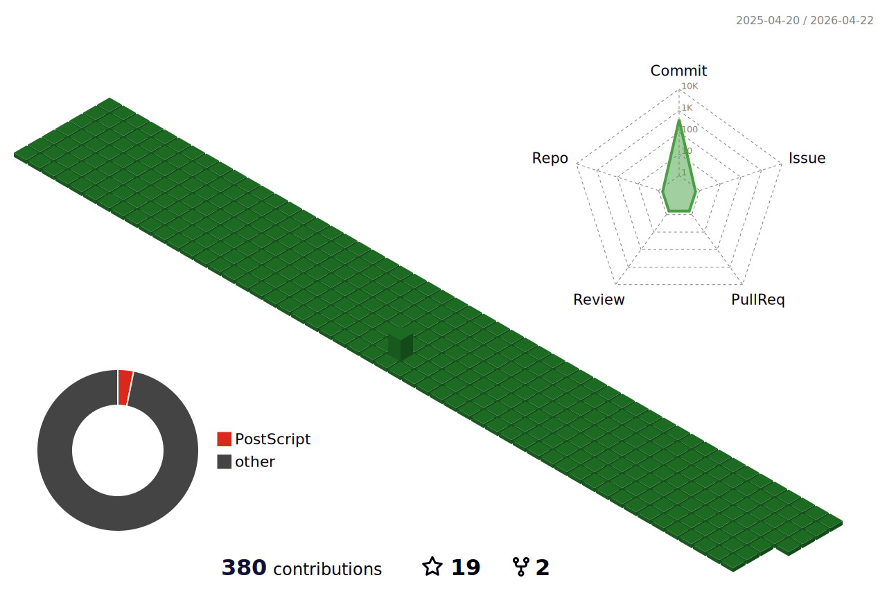

  &nbsp; &nbsp; &nbsp; &nbsp; &nbsp;
  

  &nbsp; &nbsp; &nbsp; &nbsp; &nbsp;
  

    <h3 align="left">Languages and Tools:</h3>
    
  

  &nbsp; &nbsp; &nbsp; &nbsp; &nbsp;
  

    <h3 align="center">Languages and Tools:</h3>
    
  

<!--   -->

<h3 align="left">Languages and Tools:</h3>

                           

 

