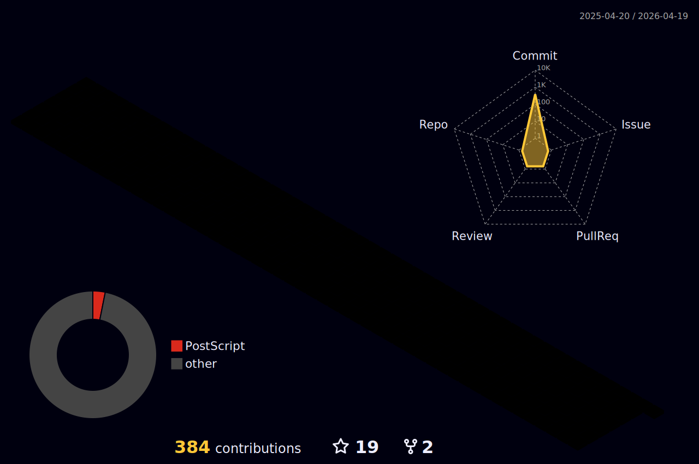

<!-- 깃허브 Markdown에서는 <tr style="background-color: #000000;"> 적용 불가 -->

    <table>
        <tr style="background-color: #000000;">
            <td width="55%" align="center"><b></b></td>
            <td height="100%" align="center"></td>
        </tr>
        <tr style="background-color: #000000;"> 
            <td align="center"><b></b></td>
            <td align="center"></td>
        </tr>
    </table>

<!-- Hits, Links -->

 

<!-- Languages and Tools -->

    <table>
        <tr>
            <td width="55%" align="center"><b>
            Programming Language
            </b></td>
            <td height="100%" align="center">
            IDE
            </td>
            <td height="100%" align="center">
            OS
            </td>
            </td>
        </tr>
        <tr> 
            <td width="55%" align="center"><b>
            

</b></td>
            <td height="100%" align="center">
             
            
            
            </td>
            <td height="100%" align="center">
             

            </td>
        </tr>
    <tr align="center">
        <td colspan="3"><b> Other Stacks </b>
        </td>
    </tr>
    <tr align="center">
        <td colspan="3"><b> 
        
  
  
  
  
  

 

 

 
</b>
        </td>
    </tr>
    </table>

<!-- Snake -->

<!-- 3D Grass -->

